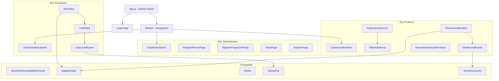
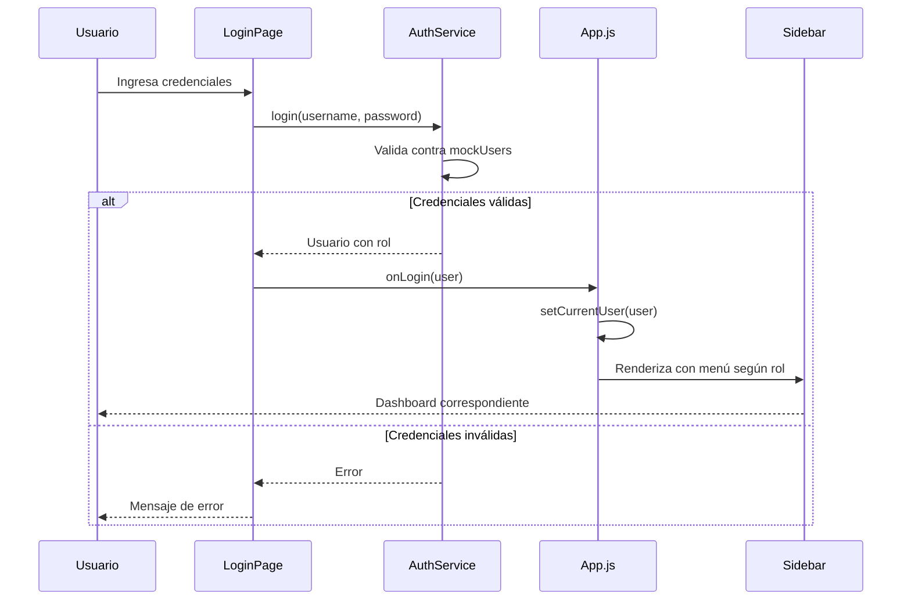
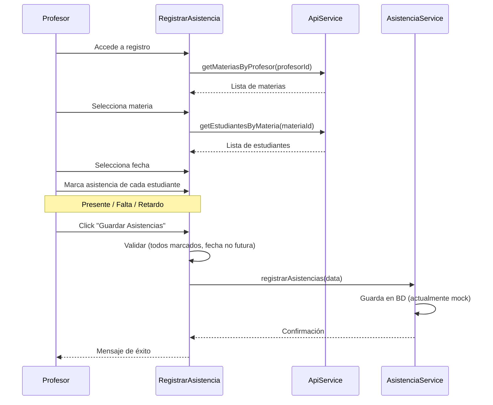
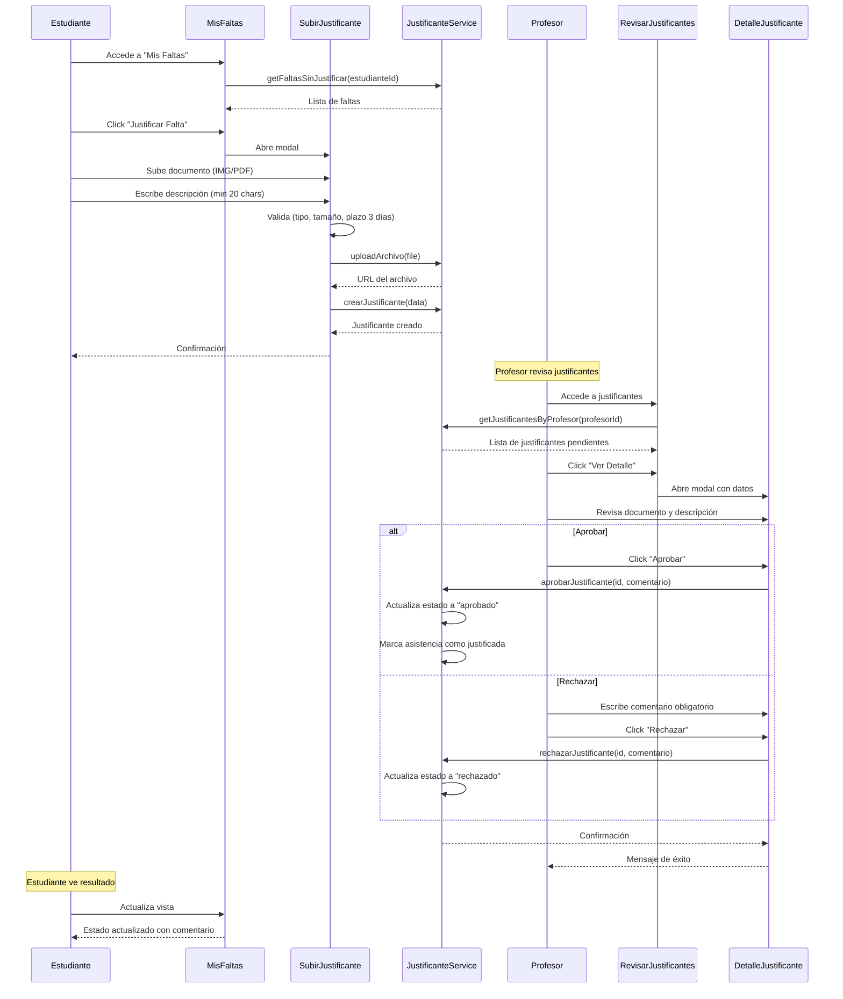
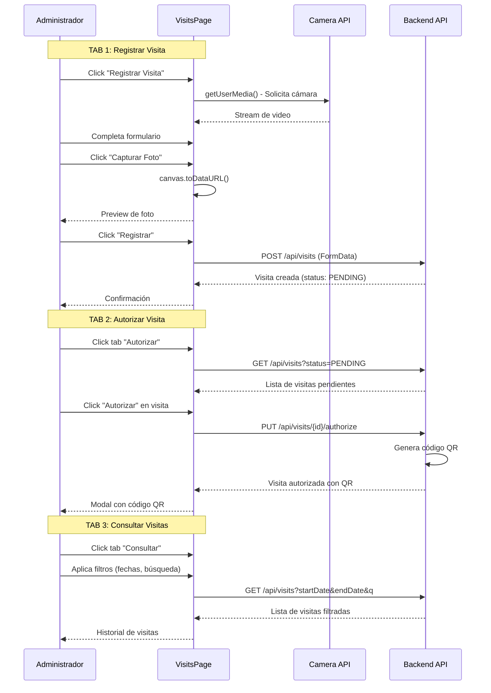

# SICA - Sistema Integral de Control de Acceso

## Descripción General

SICA es un sistema web integral para la gestión de acceso y asistencia en instituciones educativas. El sistema proporciona control biométrico de acceso, registro de asistencias, gestión de justificantes y generación de reportes, adaptándose a tres roles principales: Administradores, Profesores y Estudiantes.

## Características Principales

- **Control de Acceso**: Registro biométrico (huella dactilar) y gestión de entradas/salidas
- **Gestión de Asistencias**: Registro y seguimiento de asistencias por materia
- **Sistema de Justificantes**: Proceso completo de solicitud, revisión y aprobación de justificantes
- **Gestión de Visitas**: Registro de visitantes con captura fotográfica y autorización con QR
- **Reportes**: Generación de reportes en PDF de asistencias y accesos
- **Roles**: Sistema de permisos basado en roles (Administrador, Profesor, Estudiante)

---

## Stack Tecnológico

### Frontend
- **Framework**: React 18.3.1
- **Estilos**: Tailwind CSS 3.4.1
- **Iconos**: Lucide React
- **Generación PDF**: jsPDF + jsPDF-AutoTable
- **Build Tool**: Create React App (Webpack)

### Backend (Requerido - Por Desarrollar)
- API RESTful en `http://localhost:8080/api`
- API Key: `686a8466-e810-4405-b173-8f24cdbd0126`

---

## Estructura del Proyecto

```
sicaFront/
├── src/
│   ├── assets/
│   │   ├── images/              # Logo y recursos visuales
│   │   └── styles/              # Estilos globales
│   │
│   ├── components/
│   │   ├── admin/               # Componentes de administrador
│   │   │   └── DashboardAdmin.js
│   │   ├── commons/             # Componentes reutilizables de formularios
│   │   │   ├── FormCard.js
│   │   │   └── InputField.js
│   │   ├── estudiante/          # Componentes de estudiante
│   │   │   ├── CardFalta.js
│   │   │   ├── DashboardEstudiante.js
│   │   │   ├── MisFaltas.js
│   │   │   └── SubirJustificante.js
│   │   ├── layout/              # Componentes de layout
│   │   │   ├── HomePage.js
│   │   │   └── Navbar.js
│   │   ├── pages/               # Páginas principales
│   │   │   ├── LoginPage.js
│   │   │   ├── RegisterFingerprintPage.js
│   │   │   ├── RegisterPersonPage.js
│   │   │   ├── RegisterVisitorPage.js
│   │   │   ├── ReportsPage.js
│   │   │   └── VisitsPage.js
│   │   ├── profesor/            # Componentes de profesor
│   │   │   ├── DashboardProfesor.js
│   │   │   ├── DetalleJustificante.js
│   │   │   ├── RegistrarAsistencia.js
│   │   │   ├── RevisarJustificantes.js
│   │   │   └── TablaAsistencia.js
│   │   ├── reportes/            # Componentes de reportes
│   │   │   ├── ReporteAsistenciasProfesor.js
│   │   │   └── ReporteEntradaSalidaPersonal.js
│   │   └── shared/              # Componentes compartidos
│   │       ├── BadgeEstado.js
│   │       ├── Card.js
│   │       ├── CardMateria.js
│   │       ├── Modal.js
│   │       ├── Sidebar.js
│   │       ├── UploadFile.js
│   │       └── VisorDocumento.js
│   │
│   ├── hooks/                   # Custom Hooks
│   │   ├── useAsistencias.js
│   │   ├── useJustificantes.js
│   │   └── useUpload.js
│   │
│   ├── services/                # Servicios y lógica de negocio
│   │   ├── apiService.js
│   │   ├── asistenciaService.js
│   │   ├── authService.js
│   │   ├── justificanteService.js
│   │   └── mockData.js
│   │
│   ├── types/                   # Definiciones de tipos
│   │   ├── asistencia.types.js
│   │   ├── justificante.types.js
│   │   └── materia.types.js
│   │
│   ├── utils/                   # Utilidades
│   │   ├── formatters.js
│   │   └── validaciones.js
│   │
│   ├── App.js                   # Componente principal
│   ├── index.js                 # Punto de entrada
│   └── index.css                # Estilos globales
│
├── public/
├── package.json
├── tailwind.config.js
└── README.md
```

---

## Arquitectura de Componentes



---

## Flujo de Autenticación



---

## Flujo de Registro de Asistencias (Profesor)



---

## Flujo de Justificantes (Estudiante-Profesor)



---

## Flujo de Gestión de Visitas (Administrador)



---

## Modelos de Datos

### Usuario (User)
```typescript
{
  id: string
  username: string
  password: string
  name: string
  firstName: string
  lastName: string
  email: string
  role: 'Administrador' | 'Profesor' | 'Estudiante'
  foto: string                    // URL de la foto
  matricula?: string              // Solo estudiantes
  numeroEmpleado?: string         // Solo empleados
  activo: boolean
  creadoEn: string                // ISO 8601
}
```

### Materia (Subject)
```typescript
{
  id: string
  nombre: string
  codigo: string
  profesorId: string
  profesorNombre: string
  estudiantesIds: string[]
  horario: Array<{
    dia: string
    horaInicio: string
    horaFin: string
  }>
}
```

### Asistencia (Attendance)
```typescript
{
  id: string
  estudianteId: string
  estudianteNombre: string
  estudianteFoto: string
  profesorId: string
  profesorNombre: string
  materiaId: string
  materiaNombre: string
  fecha: string                   // YYYY-MM-DD
  estado: 'presente' | 'falta' | 'retardo'
  justificado: boolean
  creadoEn: string
  actualizadoEn: string
}
```

### Justificante (Justification)
```typescript
{
  id: string
  asistenciaId: string
  estudianteId: string
  estudianteNombre: string
  estudianteFoto: string
  profesorId: string
  materiaId: string
  materiaNombre: string
  archivoUrl: string
  archivoTipo: 'imagen' | 'pdf'
  descripcion: string
  estado: 'pendiente' | 'aprobado' | 'rechazado'
  comentarioProfesor: string | null
  creadoEn: string
  revisadoEn: string | null
}
```

### Registro de Acceso (Access Record)
```typescript
{
  id: string
  usuarioId: string
  usuarioNombre: string
  usuarioFoto: string
  tipo: 'entrada' | 'salida'
  fecha: string                   // YYYY-MM-DD
  hora: string                    // HH:mm:ss
  dispositivo: string
  ubicacion: string
  metodo: 'huella' | 'tarjeta'
  creadoEn: string
}
```

### Visita (Visit)
```typescript
{
  id: string
  visitorName: string
  visitDatetime: string           // ISO 8601
  personVisited: string
  visitorPhoto: string            // Data URL o path
  status: 'PENDING' | 'AUTORIZADO'
  authorizedBy?: string
  authorizedAt?: string
  qrCodeBase64?: string
}
```

---

## API Endpoints Requeridos

### Autenticación

#### POST /api/login
Autentica un usuario en el sistema.

**Request Body:**
```json
{
  "username": "string",
  "password": "string"
}
```

**Response (200):**
```json
{
  "id": "string",
  "username": "string",
  "name": "string",
  "role": "Administrador | Profesor | Estudiante",
  "email": "string",
  "foto": "string"
}
```

**Response (401):**
```json
{
  "error": "Credenciales inválidas"
}
```

---

### Gestión de Personas

#### GET /api/persons
Obtiene todas las personas registradas.

**Response (200):**
```json
[
  {
    "id": "string",
    "nombre": "string",
    "tipo": "Estudiante | Profesor | Administrativo | Directivo",
    "email": "string",
    "foto": "string",
    "activo": boolean
  }
]
```

#### POST /api/persons
Registra una nueva persona en el sistema.

**Request Body (Estudiante):**
```json
{
  "tipo": "Estudiante",
  "nombre": "string",
  "apellidoPaterno": "string",
  "apellidoMaterno": "string",
  "email": "string",
  "telefono": "string",
  "matricula": "string",
  "nivel": "Ingeniería | TSU",
  "division": "string",
  "carrera": "string",
  "turno": "Matutino | Vespertino"
}
```

**Request Body (Empleado):**
```json
{
  "tipo": "Profesor | Administrativo | Directivo",
  "nombre": "string",
  "apellidoPaterno": "string",
  "apellidoMaterno": "string",
  "email": "string",
  "telefono": "string",
  "numeroEmpleado": "string",
  "area": "string",
  "turno": "Matutino | Vespertino",
  "horaEntrada": "HH:mm",
  "horaSalida": "HH:mm"
}
```

**Response (201):**
```json
{
  "id": "string",
  "message": "Persona registrada exitosamente"
}
```

#### GET /api/catalogs
Obtiene catálogos dinámicos (divisiones, carreras).

**Query Params:**
- `type`: "INGENIERIA" | "TSU"
- `idFather`: ID del padre (opcional, para catálogos anidados)

**Response (200):**
```json
[
  {
    "id": "string",
    "nombre": "string"
  }
]
```

---

### Gestión de Materias

#### GET /api/materias/profesor/{profesorId}
Obtiene las materias que imparte un profesor.

**Response (200):**
```json
[
  {
    "id": "string",
    "nombre": "string",
    "codigo": "string",
    "estudiantesIds": ["string"]
  }
]
```

#### GET /api/materias/estudiante/{estudianteId}
Obtiene las materias en las que está inscrito un estudiante.

**Response (200):**
```json
[
  {
    "id": "string",
    "nombre": "string",
    "codigo": "string",
    "profesorId": "string",
    "profesorNombre": "string"
  }
]
```

#### GET /api/materias/{materiaId}/estudiantes
Obtiene los estudiantes inscritos en una materia.

**Response (200):**
```json
[
  {
    "id": "string",
    "nombre": "string",
    "matricula": "string",
    "foto": "string"
  }
]
```

---

### Gestión de Asistencias

#### GET /api/asistencias/estudiante/{estudianteId}
Obtiene todas las asistencias de un estudiante.

**Query Params (opcionales):**
- `startDate`: YYYY-MM-DD
- `endDate`: YYYY-MM-DD
- `materiaId`: string

**Response (200):**
```json
[
  {
    "id": "string",
    "materiaId": "string",
    "materiaNombre": "string",
    "fecha": "YYYY-MM-DD",
    "estado": "presente | falta | retardo",
    "justificado": boolean,
    "profesorNombre": "string"
  }
]
```

#### GET /api/asistencias/estudiante/{estudianteId}/faltas-sin-justificar
Obtiene las faltas no justificadas de un estudiante.

**Response (200):**
```json
[
  {
    "id": "string",
    "materiaId": "string",
    "materiaNombre": "string",
    "fecha": "YYYY-MM-DD",
    "profesorNombre": "string",
    "diasTranscurridos": number
  }
]
```

#### GET /api/asistencias/materia/{materiaId}
Obtiene las asistencias de una materia en una fecha específica.

**Query Params:**
- `fecha`: YYYY-MM-DD (requerido)

**Response (200):**
```json
[
  {
    "id": "string",
    "estudianteId": "string",
    "estudianteNombre": "string",
    "estado": "presente | falta | retardo"
  }
]
```

#### POST /api/asistencias
Registra asistencias de múltiples estudiantes.

**Request Body:**
```json
{
  "materiaId": "string",
  "profesorId": "string",
  "fecha": "YYYY-MM-DD",
  "asistencias": [
    {
      "estudianteId": "string",
      "estado": "presente | falta | retardo"
    }
  ]
}
```

**Response (201):**
```json
{
  "success": true,
  "registradas": number
}
```

#### PUT /api/asistencias/{id}
Actualiza una asistencia existente.

**Request Body:**
```json
{
  "estado": "presente | falta | retardo",
  "justificado": boolean
}
```

**Response (200):**
```json
{
  "id": "string",
  "message": "Asistencia actualizada"
}
```

#### PUT /api/asistencias/{id}/justificar
Marca una asistencia como justificada.

**Response (200):**
```json
{
  "id": "string",
  "justificado": true
}
```

---

### Gestión de Justificantes

#### GET /api/justificantes/estudiante/{estudianteId}
Obtiene todos los justificantes de un estudiante.

**Response (200):**
```json
[
  {
    "id": "string",
    "asistenciaId": "string",
    "materiaNombre": "string",
    "fecha": "YYYY-MM-DD",
    "estado": "pendiente | aprobado | rechazado",
    "archivoUrl": "string",
    "archivoTipo": "imagen | pdf",
    "descripcion": "string",
    "comentarioProfesor": "string | null",
    "creadoEn": "string",
    "revisadoEn": "string | null"
  }
]
```

#### GET /api/justificantes/profesor/{profesorId}
Obtiene los justificantes de las materias de un profesor.

**Query Params (opcionales):**
- `estado`: "pendiente" | "aprobado" | "rechazado"

**Response (200):**
```json
[
  {
    "id": "string",
    "asistenciaId": "string",
    "estudianteId": "string",
    "estudianteNombre": "string",
    "estudianteFoto": "string",
    "materiaId": "string",
    "materiaNombre": "string",
    "fecha": "YYYY-MM-DD",
    "archivoUrl": "string",
    "archivoTipo": "imagen | pdf",
    "descripcion": "string",
    "estado": "pendiente | aprobado | rechazado",
    "creadoEn": "string"
  }
]
```

#### GET /api/justificantes/{id}
Obtiene los detalles de un justificante específico.

**Response (200):**
```json
{
  "id": "string",
  "asistenciaId": "string",
  "estudianteId": "string",
  "estudianteNombre": "string",
  "estudianteFoto": "string",
  "profesorId": "string",
  "materiaId": "string",
  "materiaNombre": "string",
  "fecha": "YYYY-MM-DD",
  "archivoUrl": "string",
  "archivoTipo": "imagen | pdf",
  "descripcion": "string",
  "estado": "pendiente | aprobado | rechazado",
  "comentarioProfesor": "string | null",
  "creadoEn": "string",
  "revisadoEn": "string | null"
}
```

#### POST /api/justificantes
Crea un nuevo justificante.

**Request Body:**
```json
{
  "asistenciaId": "string",
  "estudianteId": "string",
  "profesorId": "string",
  "materiaId": "string",
  "archivoUrl": "string",
  "archivoTipo": "imagen | pdf",
  "descripcion": "string"
}
```

**Response (201):**
```json
{
  "id": "string",
  "estado": "pendiente",
  "message": "Justificante creado exitosamente"
}
```

#### PUT /api/justificantes/{id}/aprobar
Aprueba un justificante.

**Request Body:**
```json
{
  "comentarioProfesor": "string"
}
```

**Response (200):**
```json
{
  "id": "string",
  "estado": "aprobado",
  "revisadoEn": "string"
}
```

#### PUT /api/justificantes/{id}/rechazar
Rechaza un justificante.

**Request Body:**
```json
{
  "comentarioProfesor": "string"  // Requerido
}
```

**Response (200):**
```json
{
  "id": "string",
  "estado": "rechazado",
  "revisadoEn": "string"
}
```

---

### Carga de Archivos

#### POST /api/upload
Sube un archivo al servidor.

**Request:**
- Content-Type: `multipart/form-data`
- Field name: `file`
- Tipos permitidos: JPG, PNG, PDF
- Tamaño máximo: 5MB

**Response (200):**
```json
{
  "success": true,
  "url": "string",
  "fileUrl": "string"
}
```

**Response (400):**
```json
{
  "success": false,
  "error": "Tipo de archivo no permitido | Archivo demasiado grande"
}
```

---

### Registros de Acceso

#### GET /api/attendance-records
Obtiene todos los registros de entrada/salida.

**Query Params (opcionales):**
- `usuarioId`: string
- `startDate`: YYYY-MM-DD
- `endDate`: YYYY-MM-DD
- `tipo`: "entrada" | "salida"

**Response (200):**
```json
[
  {
    "id": "string",
    "usuarioId": "string",
    "usuarioNombre": "string",
    "usuarioFoto": "string",
    "tipo": "entrada | salida",
    "fecha": "YYYY-MM-DD",
    "hora": "HH:mm:ss",
    "dispositivo": "string",
    "ubicacion": "string",
    "metodo": "huella | tarjeta",
    "creadoEn": "string"
  }
]
```

#### GET /api/v1/incidents/absences/person/{personId}
Obtiene reporte de ausencias de una persona.

**Query Params:**
- `startDate`: YYYY-MM-DD (requerido)
- `endDate`: YYYY-MM-DD (requerido)

**Response (200):**
```json
{
  "personId": "string",
  "personName": "string",
  "totalAbsences": number,
  "absences": [
    {
      "date": "YYYY-MM-DD",
      "reason": "string"
    }
  ]
}
```

#### GET /api/v1/incidents/tardiness/person/{personId}
Obtiene reporte de retardos de una persona.

**Query Params:**
- `startDate`: YYYY-MM-DD (requerido)
- `endDate`: YYYY-MM-DD (requerido)

**Response (200):**
```json
{
  "personId": "string",
  "personName": "string",
  "totalTardiness": number,
  "tardinessRecords": [
    {
      "date": "YYYY-MM-DD",
      "scheduledTime": "HH:mm",
      "arrivalTime": "HH:mm",
      "minutesLate": number
    }
  ]
}
```

---

### Gestión de Visitas

#### GET /api/visits
Obtiene las visitas registradas.

**Query Params (opcionales):**
- `status`: "PENDING" | "AUTORIZADO"
- `q`: string (búsqueda por nombre)
- `startDate`: YYYY-MM-DD
- `endDate`: YYYY-MM-DD

**Response (200):**
```json
[
  {
    "id": "string",
    "visitorName": "string",
    "visitDatetime": "string",
    "personVisited": "string",
    "visitorPhoto": "string",
    "status": "PENDING | AUTORIZADO",
    "authorizedBy": "string | null",
    "authorizedAt": "string | null",
    "qrCodeBase64": "string | null"
  }
]
```

#### POST /api/visits
Registra una nueva visita.

**Request:**
- Content-Type: `multipart/form-data`
- Fields:
    - `visit`: JSON string con datos de la visita
    - `photo`: archivo de imagen

**Visit JSON:**
```json
{
  "visitorName": "string",
  "visitDatetime": "string",
  "personVisited": "string"
}
```

**Response (201):**
```json
{
  "id": "string",
  "status": "PENDING",
  "message": "Visita registrada exitosamente"
}
```

#### PUT /api/visits/{id}/authorize
Autoriza una visita pendiente.

**Request Body (opcional):**
```json
{
  "authorizedBy": "string"
}
```

**Response (200):**
```json
{
  "id": "string",
  "status": "AUTORIZADO",
  "qrCodeBase64": "string",
  "authorizedAt": "string"
}
```

---

## Instalación y Configuración

### Prerequisitos
- Node.js >= 14.x
- npm >= 6.x

### Instalación

1. Clonar el repositorio:
```bash
git clone <repository-url>
cd sicaFront
```

2. Instalar dependencias:
```bash
npm install
```

3. Configurar variables de entorno (crear archivo `.env`):
```env
REACT_APP_API_URL=http://localhost:8080/api
REACT_APP_API_KEY=686a8466-e810-4405-b173-8f24cdbd0126
```

4. Iniciar el servidor de desarrollo:
```bash
npm start
```

La aplicación estará disponible en `http://localhost:3000`

### Scripts Disponibles

```bash
npm start          # Inicia el servidor de desarrollo
npm run build      # Construye la aplicación para producción
npm test           # Ejecuta los tests
npm run eject      # Expone configuración de CRA (irreversible)
```

---

## Modo Mock (Desarrollo sin Backend)

El sistema incluye un modo mock completo que permite desarrollo sin backend:

### Activación del Modo Mock

En cada archivo de servicio (`src/services/*.js`), existe una constante:

```javascript
const USE_MOCKS = true; // Cambiar a false para usar API real
```

### Características del Modo Mock

- **Usuarios precargados**:
    - Administrador: `admin` / `123`
    - Profesores: `j.perez` / `123`, `m.lopez` / `123`
    - Estudiantes: `a.gomez` / `123`, `c.martinez` / `123`, etc.

- **Datos de prueba**:
    - 3 materias con estudiantes inscritos
    - 14 registros de asistencia
    - 3 justificantes (pendiente, aprobado, rechazado)
    - 20+ registros de acceso

- **Simulación de red**: Delay de 500-1000ms para simular latencia

- **Persistencia temporal**: Los datos se mantienen durante la sesión (se pierden al recargar)

### Desactivar Modo Mock

Para conectar con el backend real:

1. Cambiar `USE_MOCKS = false` en todos los servicios
2. Asegurarse de que el backend esté corriendo en `http://localhost:8080`
3. Configurar correctamente las variables de entorno

---

## Validaciones y Reglas de Negocio

### Asistencias
- No se puede registrar asistencia en fechas futuras
- Todos los estudiantes deben ser marcados antes de guardar
- Solo se puede editar asistencia del mismo día

### Justificantes
- **Plazo**: 3 días calendario desde la falta
- **Archivo**: JPG, PNG o PDF, máximo 5MB
- **Descripción**: Mínimo 20 caracteres
- **Revisión**: Comentario obligatorio para rechazar, opcional para aprobar
- Un justificante solo puede ser revisado una vez (no se puede cambiar después)

### Reportes
- Rango de fechas: Máximo 1 mes
- Reportes de entrada/salida: Solo dentro del mismo mes
- Formato de exportación: PDF con logo institucional

### Visitas
- Foto obligatoria del visitante
- Fecha/hora de visita no puede ser en el pasado
- Solo administradores pueden autorizar
- QR se genera automáticamente al autorizar

---

## Características de UI/UX

### Componentes Reutilizables
- **BadgeEstado**: Badges de colores según estado
    - Verde: Presente / Aprobado
    - Rojo: Falta / Rechazado
    - Amarillo: Retardo / Pendiente

- **Modal**: Modales con overlay y animaciones
- **Card**: Tarjetas con sombras y bordes redondeados
- **UploadFile**: Componente de carga con preview
- **VisorDocumento**: Visor de imágenes y PDFs incrustados

### Navegación
- Sidebar fijo con menú según rol
- Navegación sin recarga (SPA sin React Router)
- Breadcrumbs implícitos en títulos de página

### Feedback Visual
- Alertas de éxito/error con auto-dismiss
- Loading states en botones
- Validación en tiempo real en formularios
- Previews antes de confirmar acciones

### Responsive Design
- Grid adaptativo con Tailwind
- Sidebar colapsable en móvil
- Tablas con scroll horizontal en pantallas pequeñas
- Modales full-screen en móvil

---

## Arquitectura de Servicios

### Capa de Abstracción

El frontend está diseñado con una capa de servicios que abstrae la lógica de datos:

```
Componentes React
      ↓
Custom Hooks (useAsistencias, useJustificantes)
      ↓
Services (asistenciaService, justificanteService)
      ↓
API Service (Fetch con interceptors)
      ↓
Backend API
```

### Ventajas
- Fácil testing (mock a nivel de servicio)
- Cambio de backend transparente
- Lógica de negocio centralizada
- Reutilización de código

---

## Próximos Pasos para el Backend

### Prioridad Alta
1. **Autenticación JWT**: Implementar login con tokens
2. **CRUD de Personas**: Endpoints de alta/baja/modificación
3. **Sistema de Asistencias**: Registro y consulta de asistencias
4. **Gestión de Justificantes**: Workflow completo de justificaciones
5. **Upload de Archivos**: Almacenamiento en S3 o filesystem

### Prioridad Media
6. **Gestión de Visitas**: CRUD completo con generación de QR
7. **Reportes**: Endpoints para exportación de datos
8. **Catálogos**: Divisiones, carreras, áreas dinámicas

### Prioridad Baja
9. **Integración Biométrica**: SDK de lector de huellas
10. **Notificaciones**: Email/SMS para eventos importantes
11. **Dashboard Analytics**: Métricas y estadísticas en tiempo real

### Tecnologías Sugeridas para Backend
- **Framework**: Spring Boot (Java) o Node.js/Express
- **Base de Datos**: PostgreSQL o MySQL
- **Autenticación**: JWT con refresh tokens
- **File Storage**: AWS S3 o MinIO
- **QR Generation**: qrcode (Node.js) o ZXing (Java)
- **Documentación**: Swagger/OpenAPI

---

## Estructura de Base de Datos Sugerida

### Tablas Principales

```sql
-- Usuarios y Personas
users (id, username, password_hash, role, person_id, created_at)
persons (id, first_name, last_name, email, phone, photo_url, active, created_at)
students (person_id, enrollment_number, level, division_id, career_id, shift)
employees (person_id, employee_number, area_id, shift, entry_time, exit_time)

-- Académico
subjects (id, name, code, professor_id, created_at)
subject_enrollments (id, subject_id, student_id, enrolled_at)
subject_schedules (id, subject_id, day, start_time, end_time)

-- Asistencias
attendances (id, student_id, subject_id, professor_id, date, status, justified, created_at, updated_at)
justifications (id, attendance_id, file_url, file_type, description, status, professor_comment, created_at, reviewed_at)

-- Control de Acceso
access_records (id, user_id, type, date, time, device, location, method, created_at)
visits (id, visitor_name, visit_datetime, person_visited, photo_url, status, authorized_by, authorized_at, qr_code, created_at)

-- Catálogos
divisions (id, name, level)
careers (id, name, division_id)
areas (id, name, description)
```

---

## Consideraciones de Seguridad

### Frontend
- Validación de inputs antes de enviar al backend
- Sanitización de archivos antes de upload
- No almacenar credenciales en localStorage
- Timeout de sesión inactiva
- XSS prevention con React (escapado automático)

### Backend (Recomendaciones)
- Autenticación JWT con refresh tokens
- Rate limiting en endpoints sensibles
- Validación de archivos (tipo MIME real, no solo extensión)
- Sanitización de inputs SQL
- CORS configurado correctamente
- HTTPS obligatorio en producción
- Encriptación de contraseñas con bcrypt
- Logs de auditoría para acciones críticas

---

## Contacto y Soporte

Para reportar issues o contribuir al proyecto, contactar al equipo de desarrollo.

---

## Licencia

[Especificar licencia del proyecto]

---

**Última actualización**: 2025-11-18
**Versión del Frontend**: 1.0.0
**Estado del Backend**: Pendiente de desarrollo
